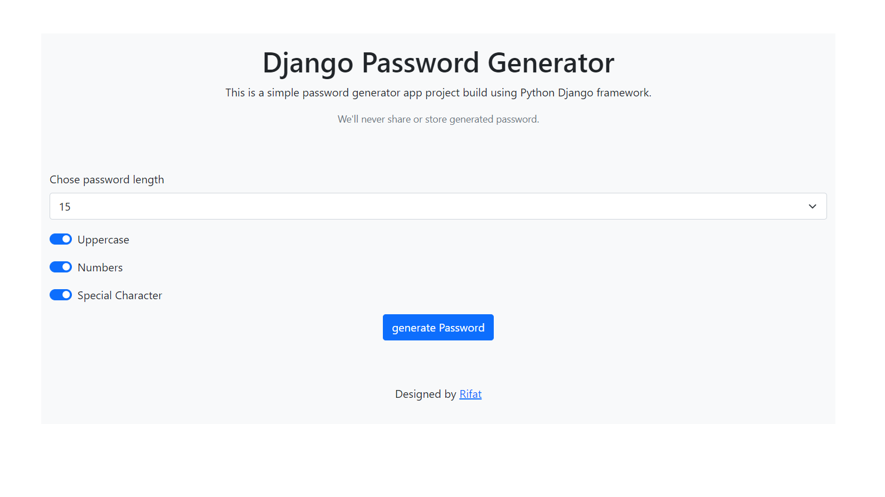
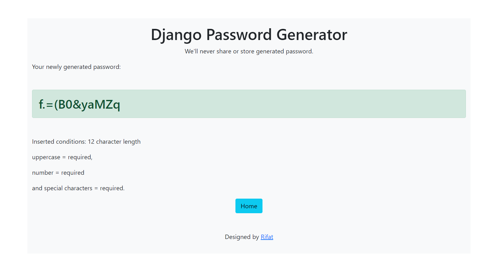

# Django Password Generator
It only randomly generate passwords based on the user input on uppercase, numbers and special character requirements.

 

### UI preview
 

 Screenshot: Home page

 Screenshot: Result page

### Tools used in the project:
HTML, Bootstrap, Python 3 and Django 3.2 framework.